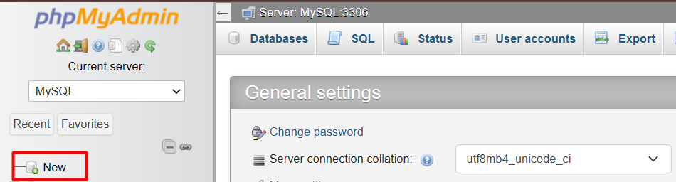
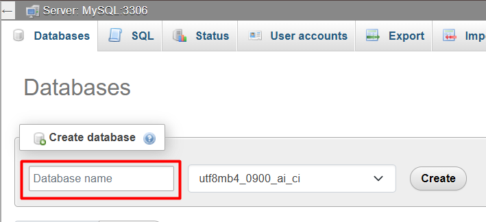
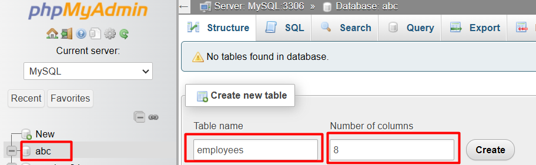

# Introduction

## What is SQL?

SQL is an acronym that stands for Structured Query Language and it is a programming language designed for managing and manipulating data stored in relational database such as MySQL.

Note: Relational Database is a type of database that stores and manages data in a structured and organized way such as tables, using relationships between different data entities.

## SQL Statements

SQL statements are instructions used to manage and manipulate data in our database. They are like commands that tell the database what to do with the data.

Some common examples of SQL statements keywords include:
* SELECT: Retrieves data from a database table
* INSERT: Adds new data to a database table
* UPDATE: Modifies existing data in a database table
* DELETE: Deletes data from a database table
* CREATE: Creates a new database table or other database structure

In this course we would be writing our Sql statements using MySql database. Before we dive deep into this topic, let us take a quick look at MySql database.

# MySQL Relational Database Management System (RDBMS)

MySQL is a Relational Database Management System (RDBMS). It is also the most popular open source SQL database management system, developed, distributed, and supported by Oracle Corporation.

## PhpMyAdmin
phpMyAdmin is a web-based database management TOOL that allows us to manage and administer MySQL and MariaDB databases. phpMyAdmin is not a database management system itself, but rather a tool that interacts with database management systems like MySQL and MariaDB.

Throughout this PHP course we would be using phpMyAdmin tool to administer MySQL database where we would store and manage our data.

## PHP and MySQL
When building a PHP application and we require a database to store or retrive data, we can utilise MySQL database.

## Summary

SQL: The programming language used to manage and manipulate data in our relational database.

SQL Statements: Commands that tell the database what to do with the data; they are written in SQL programming language.

Relational Database: Databases that stores and manages data in a structured and organized way such as tables.

MySQL: A relational database management system developed, distributed, and supported by Oracle Corporation. It is an SQL database meaning we manipulate data in this database using SQL programming language.

phpMyAdmin: A tool written in PHP used to interact with and manage MySQL database.

# Getting started with MySQL database

For the scope of this course, to work with MySQL database we need to have phpMyAdmin tool installed and running on our computer. To gain access to this tool we have to install a local server such as Wamp server or Xampp. See instructions below:

1. Download and install all necessary microsoft C++ Redistributable packages from https://wampserver.aviatechno.net/
2. Download and install Wamp (https://wampserver.aviatechno.net/) or Xampp (https://www.apachefriends.org/download.html/) on your pc
3. Start your local server to get it running
4. Access phpMyAdmin by opening your browser and typing the following url in the address bar: http://localhost/phpmyadmin/
5. If you are using phpMyAdmin for the first time you will be presented with a window where you have to select a username, password and server choice. By default enter 'root' for the username, leave password empty and select MySQL for server choice and click login

## Creating a database

Step 1: Click on 'New' at the left hand pane


Step 2: Enter a name for your database and click Create


## Creating a table in your database

I have created a database named 'abc'. For illustration purpose we are going to create a table named 'employees' where we can store employees data. Data to be stored in this table include id, first name, last name, gender, age, occupation, income and marital status of employees.

Note that in your database you can create multiple tables to store different information.

Step 1: Select the database, enter table name, select number of columns (in our case 8), click enter


Step 2: Watch video via link below for guide on step 2
https://drive.google.com/file/d/1aIJoXr_FFkG2WndyGwaw9wJ4u1IH7aLZ/view?usp=sharing

## Inserting employee data
Click your SQL tab and paste the SQL statement below in the text area input.

Ensure your column names are exactly like mine (firstName, lastName, gender, age, occupation, income, married) before running the sql statement below to avoid error

```sql
INSERT INTO employees (id, firstName, lastName, gender, age, occupation, income, married)
VALUES
    (1, 'John', 'Doe', 'Male', 20, 'Teacher', 500, false),
    (2, 'Mike', 'Abel', 'Male', 30, 'Doctor', 1000, true),
    (3, 'Jane', 'Doe', 'Female', 28, 'Nurse', 800, true),
    (4, 'James', 'Moses', 'Male', 20, 'Farmer', 800, false),
    (5, 'Janet', 'Jay', 'Female', 27, 'Teacher', 400, true),
    (6, 'Raymond', 'Fisher', 'Male', 28, 'Clergy', 500, true),
    (7, 'Kella', 'Moses', 'Female', 18, 'Student', 120, false),
    (8, 'Mat', 'Abel', 'Male', 15, 'Student', 80, false),
    (9, 'Desmond', 'Raymond', 'Male', 45, 'Accountant', 1200, true),
    (10, 'Dave', 'Nickson', 'Male', 45, 'Auditor', 900, true),
    (11, 'Sarah', 'Johnson', 'Female', 32, 'Engineer', 950, true),
    (12, 'Michael', 'Smith', 'Male', 22, 'Software Developer', 700, false),
    (13, 'Emily', 'Williams', 'Female', 25, 'Designer', 600, false),
    (14, 'Daniel', 'Brown', 'Male', 40, 'Manager', 1500, true),
    (15, 'Emma', 'Jones', 'Female', 28, 'Marketing Specialist', 850, false),
    (16, 'William', 'Davis', 'Male', 35, 'Sales Representative', 750, true),
    (17, 'Olivia', 'Miller', 'Female', 29, 'Consultant', 1100, true),
    (18, 'Liam', 'Wilson', 'Male', 23, 'Data Analyst', 680, false),
    (19, 'Ava', 'Moore', 'Female', 26, 'Writer', 520, true),
    (20, 'Noah', 'Taylor', 'Male', 31, 'Researcher', 900, false);
```

This would insert 20 employees record into our employees table

PS: Even if we do not specify id and it's values in the sql statement for the records, it will automatically assign an id for each record.

# SQL Statements
Like we stated earlier, SQL statements are like commands that tell the database what to do with the data.

Let us look at some examples of how how we can combine various SQL keywords to form an SQL statement to interact with our data.

### Select all employees from our employees table
The SQL statement to perform this query would be:

```sql
SELECT * FROM `employees`;
```

The sql statement above selects all the employees we have in our employees table. We have 2 keywords in this statement - SELECT and FROM. Note that keywords are highlighted in red or purple (depending on your theme).

### Select all Males from our employees table

```sql
SELECT * FROM `employees` WHERE gender = 'Male';
```

### Select all employees who have an income above 500

```sql
SELECT * FROM `employees` WHERE income > 500;
```

### Retrieve the first name and age of employees who are teachers.

```sql
SELECT firstName, age FROM `employees` WHERE occupation = 'Teacher';
```

### Count the number of male and female employees in the table.

```sql
SELECT gender, COUNT(*) FROM `employees` GROUP BY gender;
```

### What is the average age of all employees?
```SQL
SELECT AVG(age) FROM employees;
```

### Who is the oldest employee?
```SQL
SELECT * FROM employees ORDER BY age DESC LIMIT 1;
```

### What is the total income of all employees?
```SQL
SELECT SUM(income) FROM employees;
```

### List all employees who are married.
```SQL
SELECT * FROM employees WHERE married = true;
```

### What is the average income of male employees?
```SQL
SELECT AVG(income) FROM employees WHERE gender = 'Male';
```

### Who is the youngest employee?
```SQL
SELECT * FROM employees ORDER BY age ASC LIMIT 1;
```

### What is the total number of married male employees?
```SQL
SELECT COUNT(*) FROM employees WHERE married = true AND gender = 'Male';
```

### What is the average age of female employees?
```SQL
SELECT AVG(age) FROM employees WHERE gender = 'Female';
```

### List all employees in the medical profession (Doctor, Nurse).
```SQL
SELECT * FROM employees WHERE occupation IN ('Doctor', 'Nurse');
```

### Who is the highest-paid employee?
```SQL
SELECT * FROM employees ORDER BY income DESC LIMIT 1;
```

OR

### What is the name of the employee with the highest income?
```SQL
SELECT firstName, lastName FROM employees WHERE income = (SELECT MAX(income) FROM employees);
```

### What is the total number of employees in the accounting profession (Accountant, Auditor)?
```SQL
SELECT COUNT(*) FROM employees WHERE occupation IN ('Accountant', 'Auditor');
```

### List all employees with an age between 25 and 35.
```SQL
SELECT * FROM employees WHERE age BETWEEN 25 AND 35;
```

### What is the total number of employees in the software development profession?
```SQL
SELECT COUNT(*) FROM employees WHERE occupation = 'Software Developer';
```

### List all employees with an income below 500.
```SQL
SELECT * FROM employees WHERE income < 500;
```

### How many different occupations are represented in the table?
```SQL
SELECT COUNT(DISTINCT occupation) FROM employees;
```

### List the occupations of all employees in ascending order.
```SQL
SELECT DISTINCT occupation FROM employees ORDER BY occupation ASC;
```

### Find the employees whose last name starts with "J" and are teachers or nurses.
```SQL
SELECT * FROM employees WHERE lastName LIKE 'J%' AND (occupation = 'Teacher' OR occupation = 'Nurse');
```

Note: 'J%' gives us the records of users whose firstName starts with letter J. 
'%J%' gives us the records of users whose firstName contains the letter J. Another Eg: '%ond%' gives us users whose first name contains ond such as Raymond, Desmond, Ondu, Pondray

### Retrieve the records of employees who are neither teachers nor nurses.
```SQL
SELECT * FROM employees WHERE occupation NOT IN ('Teacher', 'Nurse');
```